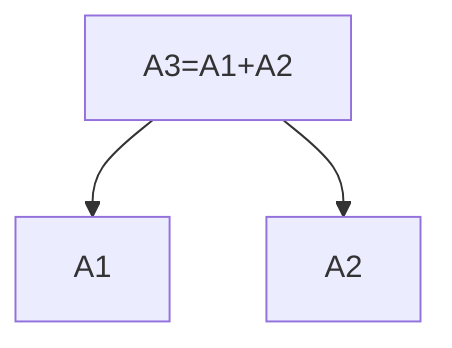
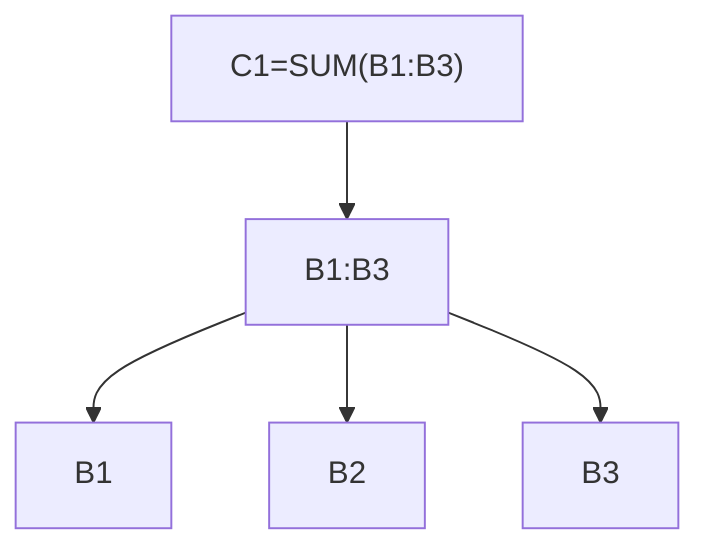

# Graphed Excel

[](https://github.com/dalager/graphedexcel/releases)
[](https://pypi.python.org/pypi/graphedexcel)

[](https://codecov.io/github/dalager/graphedexcel)
[](https://www.bestpractices.dev/projects/9620)


Tool to analyze and visualize dependencies between cells in Excel spreadsheets in order to get an understanding of the complexity.

Will generate a graph of the dependencies between cells in an Excel spreadsheet. Data extracted with `openpyxl` (<https://foss.heptapod.net/openpyxl/openpyxl>), the graph is generated with the `networkx` library (<https://networkx.org/>) and is visualized using `matplotlib`.

<br clear="right"/>

## Definitions

Single-cell references in a formula sitting in cell `A3` like `=A1+A2` is considered a dependency between the node `A3` and the nodes `A2` and `A1`.



A range defined in a formula like `=SUM(B1:B3)` is kept as a single node in the graph, but all the containing cells are expanded as dependencies of the range node.

So when a cell, `C1` contains `=SUM(B1:B3)` the graph will look like this:



## Installation from pypi package

PyPi project: [graphedexcel](https://pypi.org/project/graphedexcel/)

```bash
pip install graphedexcel
```

## Installation from source

```bash

python -m venv venv
source venv/bin/activate
pip install -e .
```

## Usage

```bash
python -m graphedexcel <path_to_excel_file>
```

### Parameters from `--help`

```
usage: graphedexcel [-h] [--as-directed-graph] [--no-visualize]
                    [--layout {spring,circular,kamada_kawai,shell,spectral}]
                    [--config CONFIG] [--output-path OUTPUT_PATH]
                    [--open-image]
                    path_to_excel

Process an Excel file to build and visualize dependency graphs.

positional arguments:
  path_to_excel         Path to the Excel file to process.

options:
  -h, --help            show this help message and exit
  --as-directed-graph, -d
                        Treat the dependency graph as directed.
  --no-visualize, -n    Skip the visualization of the dependency
                        graph.
  --layout, -l {spring,circular,kamada_kawai,shell,spectral}
                        Layout algorithm for graph visualization
                        (default: spring).
  --config, -c CONFIG   Path to the configuration file for
                        visualization. See README for details.
  --output-path, -o OUTPUT_PATH
                        Specify the output path for the generated
                        graph image.
  --open-image          Open the generated image after visualization.
  --hide-legends        Do not show legends in the visualization. (Default: False)
```

## Sample output

The following is the output of running the script on the sample `docs/Book1.xlsx` file.

```bash
===  Dependency Graph Summary ===
Cell/Node count                70
Dependency count              100


===  Most connected nodes     ===
Range Madness!A2:A11           22
Range Madness!B2:B11           11
Range Madness!F1               10
Main Sheet!B5                   4
Main Sheet!B22                  4
Detached !A2:A4                 4
Range Madness!B2                4
Range Madness!B3                4
Range Madness!B4                4
Range Madness!B5                4

===  Most used functions      ===
SUM                             4
POWER                           1

Visualizing the graph of dependencies.
This might take a while...

Graph visualization saved to images/.\Book1.xlsx.png
```

## Sample plot

More in `docs/images` folder.


## Customizing Graph Visualization Settings

You can customize the graph visualization settings by passing a path to a JSON configuration file. This allows you to override the default settings with your own preferences.

Look at <https://networkx.org/documentation/stable/reference/generated/networkx.drawing.nx_pylab.draw_networkx.html> for the available settings.

### Default Settings

The default settings for the graph visualization in the various sizes (from `graph_visualizer.py`):

```python
# Default settings for the graph visualization
base_graph_settings = {
    "node_size": 50,        # the size of the node
    "width": 0.2,           # the width of the edge between nodes
    "edge_color": "black",  # the color of the edge between nodes
    "linewidths": 0,        # the stroke width of the node border
    "with_labels": False,   # whether to show the node labels
    "font_size": 10,        # the size of the node labels
    "cmap": "tab20b",       # the color map to use for coloring nodes
    "fig_size": (10, 10),   # the size of the figure
}

# Sized-based settings for small, medium, and large graphs
small_graph_settings = {
    "with_labels": False,
    "alpha": 0.8}

medium_graph_settings = {
    "node_size": 30,
    "with_labels": False,
    "alpha": 0.4,
    "fig_size": (20, 20),
}

large_graph_settings = {
    "node_size": 20,
    "with_labels": False,
    "alpha": 0.2,
    "fig_size": (25, 25),
}

```

### Custom JSON Configuration

To override these settings, create a JSON file (e.g., graph_settings.json) with the desired settings. Here is an example of a JSON configuration file:

```json
{
  "node_size": 40,
  "edge_color": "blue",
  "with_labels": true,
  "font_size": 12,
  "alpha": 0.6
}
```

### Using the Custom Configuration

To use the custom configuration, pass the path to the JSON file as an argument to the script:

```bash
python -m graphedexcel myexcel.xlsx --config graph_settings.json
```

This will render the graph using the custom settings defined in the JSON file.

## Tests

Just run pytest in the root folder.

```bash
pytest
```

### Bandit Security Tests

To run the Bandit (<https://github.com/PyCQA/bandit>) security tests, you can use the following command.
It will report on medium and high severity safety issues.

```bash
poetry run bandit -c pyproject.toml -r . -lll
```

## Run with Docker

If you don't want to install the python dependencies on your machine, you can run the script in a Docker container. The following command will build the Docker image and run the script on the sample `docs/Book1.xlsx` file.

With a powershell terminal:

```powershell
docker build -t graphedexcel .
docker run --rm -v ${pwd}/docs:/app/docs graphedexcel docs/Book1.xlsx -o docs/av.png
```

Image will be saved in the docs folder
