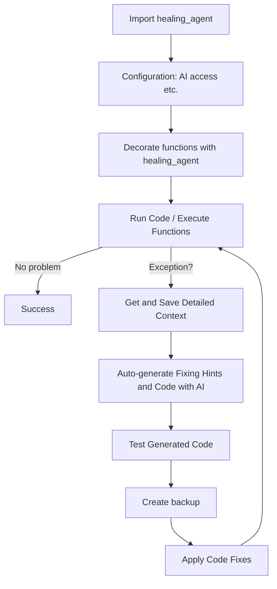

# Healing Agent 🩺

Healer Agent is an intelligent code assistant that catches with detailed context and fixes errors in your Python code. It leverages the power of AI to provide smart suggestions and corrections, helping you write more robust and "self-healing" code.

⚠️ Not intended for production use. Be extra careful with the optional AUTO_FIX function, as although it makes backups of your code, it actually changes and runs your code. ⚠️

Goal: first actually usable autonomous coding agent in production

## Features ✨

- 🚨 Automatic error detection and handling of diverse exception types
- 💡 Smart error analysis and solution suggestions (auto-generated fixing hints and code)
- 🔍 Comprehensive error analysis including exception details, stack traces, local and globalvariables and root cause identification
- 🧠 Advanced AI-powered code healing using LLMs of different providers
- 🔧 Zero-config integration with Python projects (just import and decorate)
- 💾 Robust error tracking and debugging:
  - Exception context saved to JSON (code, error details, function info and args)
  - Automatic code backups before fixes
  - Detailed analysis results and fix history
  - Quick test of fixes
- 🤖 (Optionally) Fully automated operation with minimal human intervention

## How it works 🧠



## Installation 💻

To install Healing Agent, follow these steps:

PIP package from GitHub:

```bash
pip install git+https://github.com/matebenyovszky/healing-agent
```

OR from source:

1. Clone the repository:
   ```bash
   git clone https://github.com/matebenyovszky/healing-agent.git
   ```

2. Navigate to the project directory:
   ```bash
   cd healing-agent
   ```

3. Install:
   ```bash
   pip install -e .
   ```
   OR run overall test to install and test functionality:
   ```bash
   python scripts/overall_test.py
   ```

## Usage 🔧

To use Healing Agent in your project, follow these steps:

1. Import the `healing_agent` decorator in your Python file:
   ```python
   import healing_agent
   ```

2. Decorate the function you want to monitor with `@healing_agent`:
   ```python
   @healing_agent
   def your_function():
       # Your code here
   ```
   You can also pass parameters to the decorator to change the behavior set in the config file:
   ```python
   @healing_agent(AUTO_FIX=False)
   def your_function():
       # Your code here
   ```

3. Run your Python script as usual. Healing Agent will automatically detect, save context and attempt to fix any errors that occur within the decorated function.

Context (and code file backup in case of auto-fix) is saved to a JSON/Python file in the same directory as your script with actual timestamp in the filename.

## Configuration ⚙️

Healing Agent provides extensive configuration options through the `healing_agent_config.py` file, which defines essential settings such as the AI provider and API credentials. The configuration system follows these principles:

1. **Automatic Configuration Loading**: On startup, Healing Agent attempts to load settings from `healing_agent_config.py`
2. **Fallback Mechanism**: If the configuration file is not found, the system falls back to pre-defined default settings
3. **Auto-Configuration**: When no configuration file exists, Healing Agent automatically creates one in the default user directory

### Supported AI Providers

Healing Agent integrates with multiple AI providers - list could be extended:
- OpenAI
- Azure OpenAI
- LiteLLM
- Anthropic
- Ollama

**Note**: While multiple providers are supported, Azure OpenAI has been extensively tested. Support for other providers is under active development (feedback welcome).

## Testing 🧪

To test Healing Agent, you can use the `scripts/test_file_generator.py` script to generate test files in the `tests` directory. `overall_test.py` will run all tests and provide a report on the functionality of Healing Agent.

## Use Cases 💡

- **Development**: Use Healing Agent during development to catch and fix errors early, and let AI generate fixes for your code. This is what you would do anyways, but now it's automated. 😁
- **Educational Tool**: Use Healing Agent as a learning tool to understand AI coding capabilities and limitations.

## Cooking open source 🍳

Healing Agent is distributed under the MIT License. See `LICENSE` for more information. Feedback and contributions are welcome!