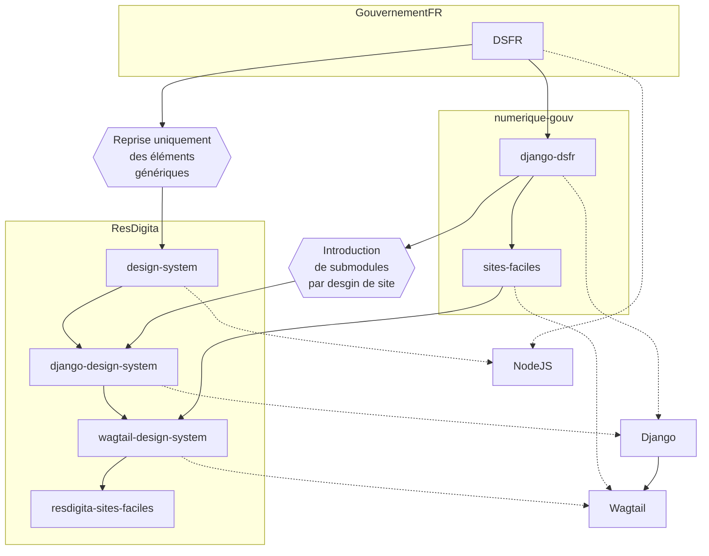

# Sites-Faciles 


Sur la base de l'application gestionnaire de contenu CMS et blog sous technologie Wagtail [sites-facile de la DINUM, France](https://github.com/numerique-gouv/sites-faciles), elle-même à base de l'application de mise en page de site dynamique Django [django-dsfr](https://github.com/numerique-gouv/django-dsfr), elle même basé sur le [Design Système de l'Etat ou DSFR du gouvernement français](https://github.com/GouvernementFR/dsfr/), cette application gestionnaire de contenu dit CMS et blog [Sites-Faciles](https://github.com/chris2fr/sites-faciles) propose de capitaliser sur le travail de fond pour le traitement d'information et de la communication en rendant les composants génériques. 

Les [conditions d’utilisation de DSFR pour des acteurs privés](https://github.com/GouvernementFR/dsfr/blob/main/doc/legal/cgu.md#2-conditions-dutilisation-des-composants-par-les-autres-utilisateurs) sont claires : 

> 2° Conditions d’utilisation des Composants par les Autres Utilisateurs
> 
> Tous les Autres Utilisateurs sont autorisés à utiliser le code source selon les conditions de la licence MIT.
> 
> Il est expressément rappelé aux Autres Utilisateurs que toute utilisation des Composants en dehors des limites visées aux présentes ou dans le but de les détourner et de s’approprier d’une manière ou d’une autre la Marque de l’État est punissable de sanctions civiles et/ou pénales.

Les conditions de l'utilisation de dango-design-system and sites-faciles (content_manager) sont encore moins problématiques un fois que la question fondamentale du DSFR est traitée de manière responsable. Le défi est de proposer un deal équitable et sympa pour l'Etat. Cela serait aidé, je pense, par la contribution fondamentale de proposer des thèmes graphiques très différents de la charte du DSFR. Il y a encore un peu de travail à faire dans ce sens, mais c'est bien parti.

Maîtriser l'ensemble de la chaîne de design-system à django-design-system à wagtail-design-system à sites-faciles a été une joie parce-que les développements sont propres et faits de manière responsable.  


Voici un autre diagramme autour de l'idée de faire un outil publiquement utilisable [wagtail-design-system](https://github.com/chris2fr/sites-faciles) avec [django-design-system](https://github.com/chris2fr/django-design-system) [Module Python django-design-system](https://pypi.org/project/django-design-system/
) et [design-system](https://github.com/chris2fr/design-system).



Voici des notes aléatoires:

```sql
CREATE USER sitesfaciles  with ENCRYPTED PASSWORD 'SOMEPASSWORD';
CREATE DATABASE "sitesfaciles" WITH OWNER "sitesfaciles" ENCODING 'UTF8';
ALTER database sitesfaciles owner to sitesfaciles;
GRANT ALL privileges ON DATABASE sitesfaciles TO sitesfaciles;
```

```bash
git clone git@github.com:chris2fr/sites-faciles.git
python -m venv venv
source venv/bin/activate
pip install pre-commit django
cp .env.example .env
python -c "from django.core.management.utils import get_random_secret_key; print(get_random_secret_key())"
vi .env
pre-commit install
pre-commit run --all-files
poetry install
poetry run python manage.py makemigrations
make migrations
make collectstatic
poetry run python manage.py createsuperuser
```

```
SECRET_KEY=<VALUE>
DEBUG=False
HOST_PROTO=http
# HOST_URL and ALLOWED_HOSTS: use 0.0.0.0 for Docker
HOST_URL=0.0.0.0
ALLOWED_HOSTS=localhost, 127.0.0.1, sites-pfaciles.resdigita.com
HOST_PORT=8890
SITE_NAME=Sites Faciles
MEDIA_ROOT=medias


```

## Texte reproduite de la DINUM

**Créez et gérez votre site internet simplement**

Gestionnaire de contenu (CMS) pour créer un site internet dont le domaine se terminant par .gouv.fr . Pas besoin de compétence technique pour mettre à jours le contenu.

**Un CMS basé sur la solution open source Wagtail**

Créez ou modifiez des pages, ajoutez un menu de navigation, des boutons, images, vidéos, contributeurs etc

**Système de Design de l'État**

Construisez vos pages à l'aide de composants prêts à l'emploi issus du Système de Design de l'État (DSFR)

**Accessible et responsive**

Le contenu des pages générées par le CMS est partiellement conforme selon la norme RGAA 4.1 et responsive

## Prérequis

- Python 3.10
- Postgreql 14.x.

## Installer les pre-commit hooks

```
pre-commit install
```

On peut faire un premier test en faisant tourner :

```
pre-commit run --all-files
```

## Installation

Le projet peut se lancer en local ou avec Docker.

### Dans tous les cas, copier les variables d’environnement

- Copier le fichier
```
cp .env.example .env
```

- Générer la `SECRET_KEY`
```
python -c "from django.core.management.utils import get_random_secret_key; print(get_random_secret_key())"
```

- Mettre les valeurs pertinentes dans le fichier `.env`

### En local
#### Installer poetry s’il ne l’est pas

Cf. la [documentation de poetry](https://python-poetry.org/docs/#installation)

#### Installer le projet

- La commande suivante installe les dépendances, fait les migrations et collecte les fichiers
```
make init
```

#### Créer un utilisateur

- La commande suivante crée un utilisateur administrateur avec tous les droits:

```
poetry run python manage.py createsuperuser
```

#### Lancer le serveur

```
make runserver
```

### via Docker
#### Lancer les containers

```sh
docker compose up
```

### Effectuer les tests
Les tests unitaires peuvent être lancés avec `make test-unit`.

Vous pouvez également générer un rapport sur la couverture de tests :
```sh
coverage run manage.py test --settings sites_faciles.config.settings_test
```

## Indexation des contenus
Les contenus des pages sont indexés pour la recherche par un script `python manage.py update_index` (cf. [documentation de Wagtail](https://docs.wagtail.org/en/stable/topics/search/indexing.html))

### Scalingo
Le script est lancé automatiquement après les déploiements sur Scalingo.

Il est recommandé de procéder à une nouvelle indexation une fois par semaine, en renommant le fichier `cron.json.example` en `cron.json` (cf. [documentation de Scalingo](https://doc.scalingo.com/platform/app/task-scheduling/scalingo-scheduler))

### Autres déploiements
Il est recommandé de faire de même pour les déploiements sur d’autres plateformes, en ajoutant une ligne à la crontab de l’utilisateur avec lequel tourne le site :

```
0 3 * * SUN python manage.py update_index
```
