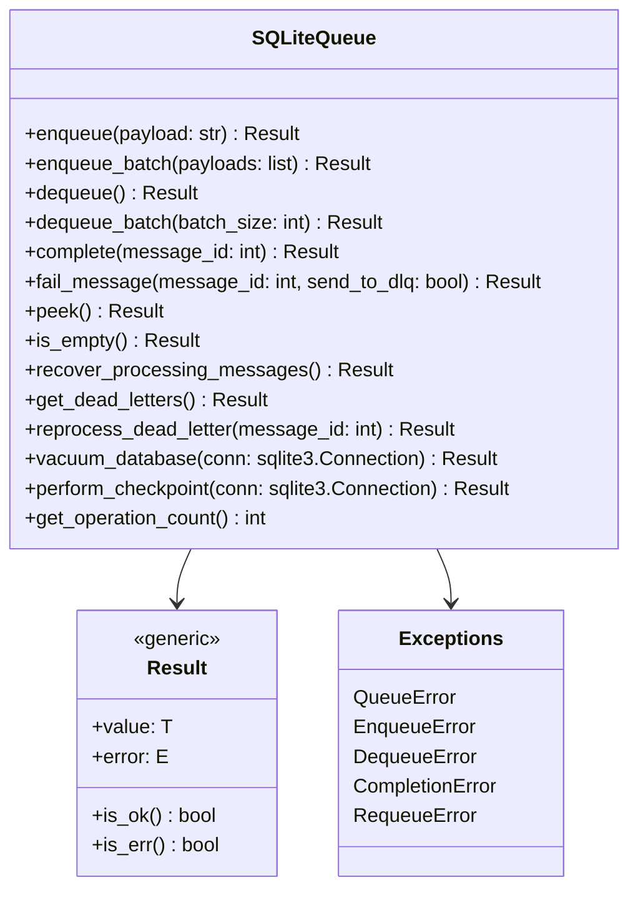
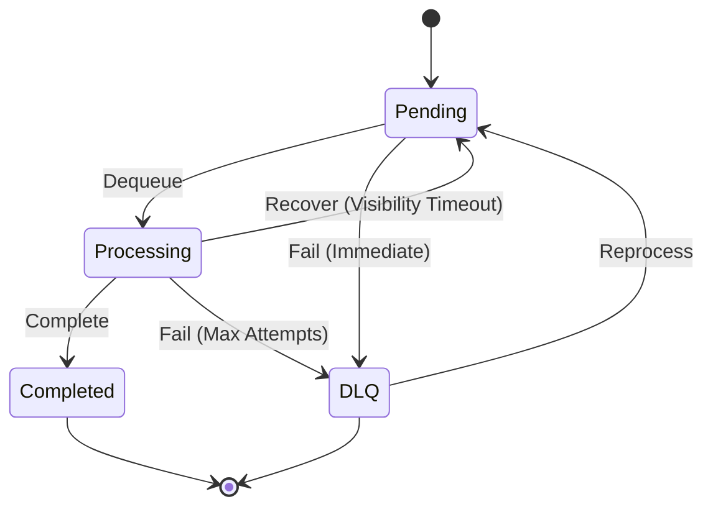
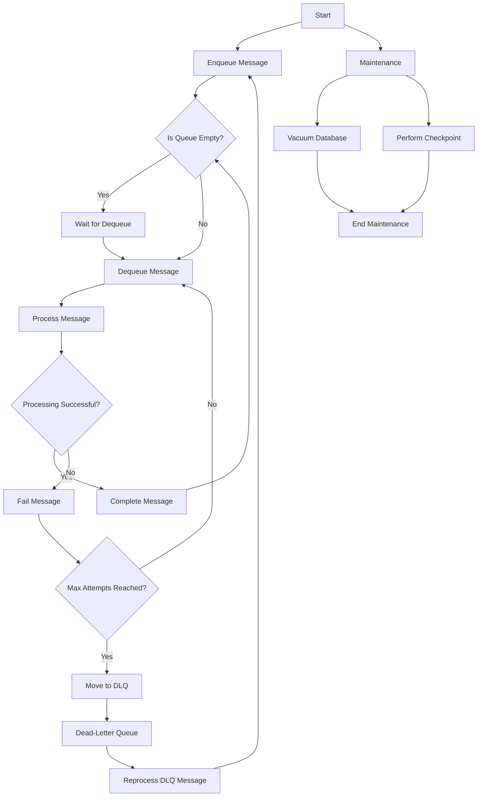

# sqqueue

`sqqueue` is a simple, persistent queue implementation backed by SQLite. It is designed for Python applications that require lightweight, reliable queuing without the overhead of setting up a dedicated message broker.

## Features

- **Persistent Storage**: Ensures messages are not lost even if the application restarts.
- **Custom Table Names**: Allows defining custom table names for flexibility.
- **Thread-Safe**: Safe to use in multi-threaded environments.
- **Logging**: Provides detailed logs for monitoring and debugging.
- **Requeueing**: Ability to requeue messages if processing fails.
- **Peek Functionality**: View the next message without altering its state.

## Build Package
   ```bash
   pip install setuptools wheel
   python setup.py sdist bdist_wheel
   ```

## Upload Package
```bash
pip install twine
twine upload dist/*
   ```

## Install Package
```bash
pip install sqqueue
```

## Usage
```python
from sqqueue.queue import SQLiteQueue

# Initialize the queue
queue = SQLiteQueue(db_path='my_queue.db', table_name='custom_queue')

# Enqueue a message
message_id = queue.enqueue('Hello, World!')
print(f"Enqueued message ID: {message_id}")

# Dequeue a message
dequeued = queue.dequeue()
if dequeued:
    message_id, payload = dequeued
    print(f"Dequeued message ID {message_id}: {payload}")
    
    # Process the message
    # ...

    # Complete the message
    queue.complete(message_id)
else:
    print("Queue is empty.")

# Requeue a message (if processing failed)
queue.requeue(message_id)

# Check if the queue is empty
if queue.is_empty():
    print("No pending messages.")
else:
    print("There are pending messages.")

```
# SQLiteQueue Library

SQLiteQueue is a lightweight, reliable message queue implemented using SQLite. It provides essential queue operations such as enqueue, dequeue, complete, fail, and support for dead-letter queues (DLQ). This README provides an overview of how to use the library, illustrated with UML and process diagrams, along with a list of potential fixes and improvements.

## Table of Contents

- [Overview](#overview)
- [Architecture Diagrams](#architecture-diagrams)
  - [Class UML Diagram](#class-uml-diagram)
  - [Message Lifecycle State Diagram](#message-lifecycle-state-diagram)
  - [Process Flow Diagram](#process-flow-diagram)
- [Usage Guide](#usage-guide)
- [Possible Fixes and Improvements](#possible-fixes-and-improvements)
- [Contributing](#contributing)
- [License](#license)

## Overview

SQLiteQueue leverages SQLite's robust database features to manage message queues efficiently. It ensures message persistence, handles concurrent access, and provides mechanisms to manage message processing states. Key features include:

- **Enqueue**: Add messages to the queue.
- **Dequeue**: Retrieve and mark messages as processing.
- **Complete**: Mark messages as processed and remove them from the queue.
- **Fail**: Handle failed message processing, with support for retry attempts and moving to DLQ.
- **Dead-Letter Queue (DLQ)**: Manage messages that failed processing after maximum attempts.
- **Batch Operations**: Enqueue and dequeue messages in batches for efficiency.
- **Maintenance**: Automatic database vacuuming and checkpointing to maintain performance.

## Architecture Diagrams

### Class UML Diagram

The following UML class diagram outlines the primary classes and their relationships within the SQLiteQueue library.



### Message Lifecycle State Diagram

This state diagram illustrates the various states a message can traverse within the queue.



### Process Flow Diagram

The process flow diagram below demonstrates the typical operations performed on the queue, from enqueueing to handling failures and maintenance.



## Usage Guide

### Installation

```bash
pip install sqqueue
```

### Basic Operations

```python
from sqqueue import SQLiteQueue

# Initialize the queue
queue = SQLiteQueue(
    db_path='path_to_db.sqlite',
    table_name='message_queue',
    vacuum_threshold=100,
    vacuum_on_start=True,
    default_max_attempts=5
)

# Enqueue a message
result = queue.enqueue("Sample Task")
if result.is_ok():
    message_id = result.value
    print(f"Enqueued message with ID: {message_id}")
else:
    print(f"Enqueue failed: {result.error}")

# Dequeue a message
dequeue_result = queue.dequeue()
if dequeue_result.is_ok():
    message = dequeue_result.value
    msg_id, payload = message
    print(f"Dequeued message ID: {msg_id}, Payload: {payload}")
else:
    print(f"Dequeue failed: {dequeue_result.error}")

# Complete a message
complete_result = queue.complete(msg_id)
if complete_result.is_ok():
    print(f"Message {msg_id} completed successfully.")
else:
    print(f"Completion failed: {complete_result.error}")

# Fail a message
fail_result = queue.fail_message(msg_id, send_to_dlq=False)
if fail_result.is_ok():
    print(f"Message {msg_id} failed and requeued.")
else:
    print(f"Failing message failed: {fail_result.error}")

# Retrieve dead letters
dlq_result = queue.get_dead_letters()
if dlq_result.is_ok():
    dead_letters = dlq_result.value
    print(f"Dead-letter messages: {dead_letters}")
else:
    print(f"Failed to retrieve dead letters: {dlq_result.error}")
```

### Batch Operations

```python
# Enqueue multiple messages
payloads = ["Task 1", "Task 2", "Task 3"]
enqueue_batch_result = queue.enqueue_batch(payloads)
if enqueue_batch_result.is_ok():
    message_ids = enqueue_batch_result.value
    print(f"Enqueued batch with IDs: {message_ids}")
else:
    print(f"Batch enqueue failed: {enqueue_batch_result.error}")

# Dequeue multiple messages
dequeue_batch_result = queue.dequeue_batch(batch_size=2)
if dequeue_batch_result.is_ok():
    messages = dequeue_batch_result.value
    for msg_id, payload in messages:
        print(f"Dequeued message ID: {msg_id}, Payload: {payload}")
else:
    print(f"Batch dequeue failed: {dequeue_batch_result.error}")
```

### Maintenance Operations

SQLiteQueue automatically performs maintenance operations like vacuuming and checkpointing based on the configured thresholds. However, you can also trigger them manually:

```python
# Vacuum the database
vacuum_result = queue.vacuum_database()
if vacuum_result.is_ok():
    print("Database vacuumed successfully.")
else:
    print(f"Vacuum failed: {vacuum_result.error}")

# Perform a WAL checkpoint
checkpoint_result = queue.perform_checkpoint()
if checkpoint_result.is_ok():
    print("WAL checkpoint performed successfully.")
else:
    print(f"Checkpoint failed: {checkpoint_result.error}")
```

## Possible Fixes and Improvements

Based on the provided test suite and understanding of the SQLiteQueue library, here are several potential fixes and enhancements to consider:

1. **Enhanced Error Handling**
   - **Issue**: Currently, errors are captured using `Result` types, but more granular error messages and logging could improve debuggability.
   - **Fix**: Implement detailed logging for each operation, including stack traces for exceptions.

2. **Concurrency Control**
   - **Issue**: While SQLite handles some concurrency, high-throughput scenarios might lead to database locks or contention.
   - **Fix**: Introduce connection pooling or implement retry mechanisms with exponential backoff for handling database locks.

3. **Visibility Timeout Configuration**
   - **Issue**: The visibility timeout (`default_visibility_timeout`) is crucial for message recovery but may need dynamic adjustment based on processing times.
   - **Fix**: Allow dynamic configuration of visibility timeouts per message or based on runtime metrics.

4. **DLQ Management Enhancements**
   - **Issue**: Currently, reprocessing DLQ messages increments the message ID, which may lead to inconsistencies.
   - **Fix**: Ensure that reprocessed messages retain their original IDs or implement a proper ID mapping system.

5. **Batch Operation Optimization**
   - **Issue**: Batch enqueue and dequeue operations may not handle partial failures gracefully.
   - **Fix**: Implement transactional batch operations where either all messages are processed successfully or the entire batch is rolled back.

6. **Monitoring and Metrics**
   - **Issue**: Lack of built-in monitoring makes it challenging to track queue performance and health.
   - **Fix**: Integrate with monitoring tools or expose metrics (e.g., operation counts, queue lengths) via APIs or logs.

7. **Configuration Flexibility**
   - **Issue**: Hardcoded configuration parameters limit adaptability.
   - **Fix**: Provide more flexible configuration options, possibly through configuration files or environment variables.

8. **Testing Enhancements**
   - **Issue**: The current test suite covers essential operations but may miss edge cases.
   - **Fix**: Expand the test suite to include scenarios like concurrent enqueue/dequeue, database corruption handling, and performance benchmarks.

9. **Documentation Improvements**
   - **Issue**: While the README covers basic usage, more detailed documentation on advanced features and customization would be beneficial.
   - **Fix**: Add comprehensive documentation with examples, API references, and best practices.

10. **Support for Multiple Queues**
    - **Issue**: The library currently supports a single queue per database instance.
    - **Fix**: Extend support to handle multiple queues within the same database, each with its own configuration.

11. **Graceful Shutdown and Cleanup**
    - **Issue**: Ensuring that all in-process messages are handled correctly during shutdown is critical.
    - **Fix**: Implement mechanisms to gracefully shut down the queue, ensuring no messages are left in an inconsistent state.

12. **Security Enhancements**
    - **Issue**: Security aspects like database encryption and access control are not addressed.
    - **Fix**: Integrate SQLite encryption extensions and provide authentication mechanisms to secure the queue data.

13. **Performance Optimization**
    - **Issue**: As the queue scales, performance may degrade due to database limitations.
    - **Fix**: Optimize database indices, query performance, and consider sharding or partitioning for large-scale deployments.

14. **User-Friendly API**
    - **Issue**: The current API might be low-level for some users.
    - **Fix**: Provide higher-level abstractions or helper functions to simplify common operations.

15. **Integration with Async Frameworks**
    - **Issue**: The library operates synchronously, which may not fit well with asynchronous applications.
    - **Fix**: Develop an asynchronous API version using `asyncio` or similar frameworks to support non-blocking operations.

Implementing these fixes and enhancements will improve the robustness, scalability, and usability of the SQLiteQueue library, making it more suitable for a wide range of applications.

## Contributing

Contributions are welcome! Please follow these steps to contribute:

1. **Fork the Repository**
2. **Create a Feature Branch**: `git checkout -b feature/YourFeature`
3. **Commit Your Changes**: `git commit -m "Add some feature"`
4. **Push to the Branch**: `git push origin feature/YourFeature`
5. **Open a Pull Request**

Please ensure that your code follows the project's coding standards and that all tests pass.

## License

This project is licensed under the [MIT License](LICENSE).

# Additional Notes

To include the diagrams in your README, ensure that your documentation platform supports Mermaid diagrams. GitHub, for instance, supports Mermaid in Markdown files as of recent updates. If your platform does not support Mermaid, consider rendering the diagrams using PlantUML or another tool and embedding them as images.